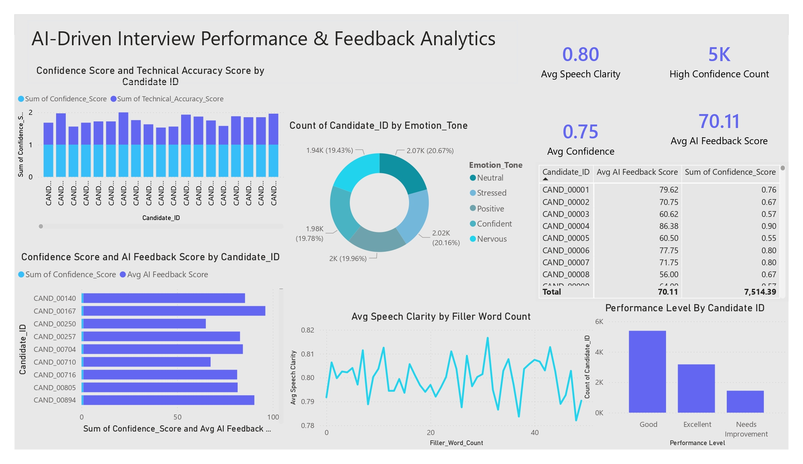

# AI-Driven Interview Performance & Feedback Analytics

## Project Overview

This Power BI dashboard analyzes candidate interview performance using AI-generated feedback, confidence scoring, speech clarity metrics, emotional tone analysis, and technical assessment results.

The dashboard helps recruiters, HR teams, and talent acquisition professionals evaluate candidate communication skills, technical competency, and overall interview performance using data-driven insights.

---

## Dashboard Preview

## Key Performance Indicators (KPIs)

| Metric | Value |
|----------|----------|
| Average Speech Clarity | 0.80 |
| Average Confidence Score | 0.75 |
| High Confidence Count | 5K |
| Average AI Feedback Score | 70.11 |

---

## Dashboard Features

### 1. Confidence vs Technical Accuracy Analysis
- Compares candidate confidence scores against technical accuracy.
- Helps identify candidates with strong technical skills and communication confidence.

### 2. Emotion Tone Distribution
Analyzes interview sentiment categories:
- Neutral
- Positive
- Confident
- Nervous
- Stressed

### 3. AI Feedback Assessment
- Displays AI-generated interview feedback scores.
- Evaluates candidate performance consistency.

### 4. Speech Clarity Monitoring
- Tracks speech clarity against filler word usage.
- Measures communication effectiveness.

### 5. Performance Level Classification
Categorizes candidates into:
- Excellent
- Good
- Needs Improvement

### 6. Candidate Performance Table
Provides detailed candidate-level metrics:
- AI Feedback Score
- Confidence Score
- Performance Indicators

---

## Business Use Cases

- AI-powered recruitment screening
- Candidate communication assessment
- Interview quality evaluation
- Hiring decision support
- Talent acquisition analytics
- HR performance reporting

---

## Tools & Technologies

- Power BI
- DAX
- Power Query
- Excel / CSV Dataset
- Data Modeling
- Data Visualization

---

---

## Key Insights

- Most candidates fall under the "Good" performance category.
- Speech clarity remains consistently high across interviews.
- Emotional tone distribution is balanced across candidate groups.
- Higher confidence scores generally correlate with stronger AI feedback ratings.

---
